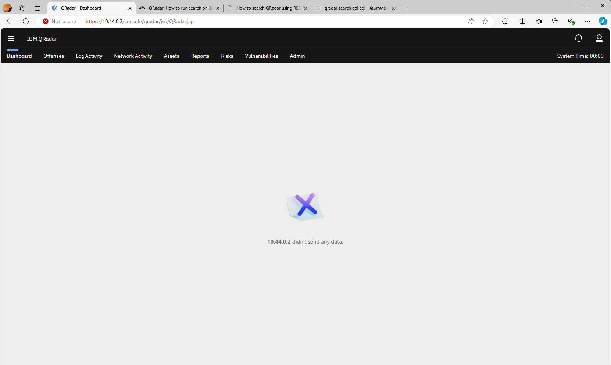

# Automated Investigator

## Table of Contents

- [Requirements](#requirements)
- [Why Typhoon](#why-typhoon)
- [What can be improved](#what-can-be-improved)
- [How to run](#how-to-run)
- [Technical Details](#technical-details)

## Requirements

All API Keys are optional, and the feature can be disabled via `cyntelligence/feature_flags.py`, but we recommend to use them if you want to utilize the tool-calling LLMs to interact with QRadar SIEM, AbuseIPDB, and VirusTotal.

- Python 3.10 & Pip (Only Tested specifically on this version) - needed as the main software runs on Python
- OpenTyphoon API Key (Free) - needed for the actual LLMs interactions and tool-calling
- AbuseIPDB API Key (Free) - needed for the file analysis via AbuseIPDB
- VirusTotal API Key (Free) - needed for the file analysis via VirusTotal
- QRadar API Key - needed for the logs/events analysis via QRadar SIEM

## Why Typhoon

Typhoon LLM is a Thai-focused Open LLM developed by SCB 10X, which understand Thai language complexity and nuance at a deeper level than other open language models due to the training and finetuning process that are focused on Thai language. Open LLM model is crucial for sensitive working environments where you might not want any kind of data to leave your network, as you can run the model locally. It is also a general purpose LLM, which can be used for a wide range of tasks, such as chat, summarization, question answering, and more. A natural Thai language support is crucial for rapid investigation and analysis without having to think of certain jargons or complex query statement. The model still retains its ability to understand and respond in English.

## What can be improved

Due to our technical resources constraint, we may not be able to create an fully offline model small enough to run without internet access (through future distillation, training on specific data, and finetuning), while also being fast enough to inference, which might be useful in sensitive environment or to allow the software to run entirely on edge devices, but we did provide a baseline for prompting existing model to follow instruction accurately, and referring to actual environment context as needed, which is one of the key element in utilizing LLMs as a tool.

We also do not have access to Premium APIs for service such as VirusTotal to fully utilize the power of such platform.

We do not have access to lab machine with high enough resource (as shown below) to run IBM QRadar SIEM, so we cannot test the ability of the tool-calling LLMs to interact with QRadar SIEM, but we did tried our best to wrote the code to interact with QRadar SIEM via Ariel Query Language using the API documentation.

The model still suffers from low context window (8192 tokens), which is a limitation of the model itself, so I have to do certain workaround on external source to reduce the context size, such as only pulling 10 engines from VirusTotal, having limited k value for Chroma, etc.

The model might have certain abilities to generate playbook script for Swimlane (According to early internal technology selection criteria assessment we have done on the LLM itself.)

## How to run

1. Install all the required dependencies via `pip install -r requirements.txt`
2. Rename `.env.example` to `.env` and fill in the required API keys, or switch off unnecessary module via `cyntelligence/feature_flags.py`
3. Run `mesop main.py`
4. Start asking questions to the LLMs such as: `ขอข้อมูลไฟล์ 7dd847e9eba6ebe8c73c45b1e8fecce43e4b73ab92d48b383516e0a6a57b00d3 หน่อย` where the hash could be any type of hash from the file you want to analyze, or you can also ask for the context of the IP address, domain, url, etc via `ขอข้อมูลที่มีอยู่ตาม ip เป็น 10.23.1.3 หน่อย` (Intentionally using Thai language to test the ability of the LLMs to understand Thai language)

## Technical Details

The main software is written in Python, and the UI is built using [Mesop](https://github.com/google/mesop) which is a Python framework for building UIs. The LLMs are all running on Typhoon, which is a Thai-focused LLM developed by SCB 10X (more details in [Why Typhoon](#why-typhoon)). We utilize RAGs to store the context of the LLMs, and the RAG utilized Chroma, which is a vector database that is optimized for storing and querying large amounts of data. We utilize the tool-calling abilities from one of the Typhoon models to interact with the RAG, and then use the context from the RAG to answer the user's question. The tool-calling model is also used to interact with external data sources such as AbuseIPDB, VirusTotal, QRadar SIEM, etc.

### Technology Selection Criteria

We have done a technology selection criteria assessment on the LLMs, and the criteria are as follows:

- LLMs should be able to understand Thai language.
- LLMs should work well in agentic workflow.
- LLMs should be able to answer questions.
- LLMs should be able to generate scripts or playbooks.
- LLMs should be open to allow for further development and fine-tuning.

The criteria are based on the following factors:

- LLMs should be able to understand Thai language
  - LLMs should be able to understand the nuances of Thai language
  - LLMs should be able to understand the context of the question
  - LLMs should be able to understand the context of the environment
- LLMs should be able to understand the context of the external data sources
- LLMs should be customizable to fit the specific needs of the user

These evaluation results were sourced from the Typhoon LLMs page on Hugging Face, and the results are as follows:

#### Agentic Capabilities

| Model            | GAIA - Thai/English | GSM8K - Thai/English | HotpotQA - Thai/English |
|------------------|---------------------|----------------------|--------------------------|
| gpt-3.5-turbo-0125 | 18.42/37.5          | 70/80                | 39.56/59                 |
| Typhoon-1.5X 70B | 17.10/36.25         | 80/95                | 52.7/65.83               |
| gpt-4-0612       | 17.10/38.75         | 90/100               | 56.41/76.25              |
| ---              | ---                 | ---                  | ---                      |
| gpt-4o           | 44.73/57.5          | 100/100              | 71.64/76.58              |

And this is from the OpenTyphoon release blog comparing their large model with large proprietary model using Stanford HELM framework

#### Language & Knowledge Capabilities

| Model                      | ONET  | IC    | TGAT  | TPAT-1 | A-Level | Average (ThaiExam) | M3Exam | MMLU  |
|----------------------------|-------|-------|-------|--------|---------|--------------------|--------|-------|
| Typhoon-1.5 72B            | 0.562 | 0.716 | 0.778 | 0.500  | 0.528   | 0.6168             | 0.587  | 0.7271 |
| OpenThaiGPT 1.0.0 70B      | 0.447 | 0.492 | 0.778 | 0.500  | 0.319   | 0.5072             | 0.493  | 0.6167 |
| GPT-3.5-turbo (01-2024)     | 0.358 | 0.279 | 0.678 | 0.345  | 0.318   | 0.3956             | 0.316  | 0.700  |
| GPT-4 (04-2024)            | 0.589 | 0.594 | 0.756 | 0.517  | 0.616   | 0.6144             | 0.626  | 0.864  |
